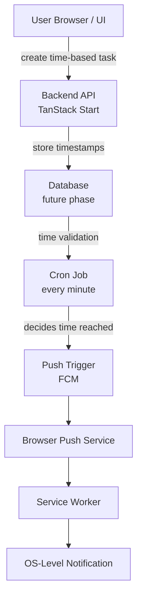

# Time-First Task Scheduler

> **A personal time-centric task scheduler** focused on **time allocation, focus, and scheduling integrity**, rather than traditional task lists.

---

## Core Philosophy

The system treats **time as the source of truth**, validates it **independently of the browser**, and delivers **push notifications even when the website is closed**.

This project is intentionally scoped for **single-user productivity**, emphasizing **correct architecture, real-world scheduling behavior, and clean separation of concerns**.

---

## Core Idea

> Most task apps track _what_ to do.  
> This project tracks **when time actually passes**.

### Key Features

- Tasks are **time-boxed** (start/end)
- Backend logic runs **even if the user closes the site**
- UI reconstructs state from timestamps
- Notifications are **reliable and background-capable**

---

## Architecture Overview

> **Key rule:**  
> Cron updates backend state.  
> The UI never talks to cron directly.

---

## Tech Stack

| Component          | Technology                     | Purpose                          |
| ------------------ | ------------------------------ | -------------------------------- |
| **Framework**      | TanStack Start                 | Full-stack framework             |
| **Frontend**       | React                          | UI layer                         |
| **Styling**        | Tailwind CSS                   | Utility-first styling            |
| **Components**     | shadcn/ui                      | Accessible UI components         |
| **Time Authority** | External Cron Service          | Time validation                  |
| **Notifications**  | Firebase Cloud Messaging (FCM) | Web Push delivery                |
| **Background**     | Service Workers                | Background notification handling |

---

## Why This Architecture Works

### Survives browser closure

Cron keeps validating time; backend state stays correct.

### Reliable notifications

Web Push + Service Workers allow OS-level alerts even when the site is closed.

### Idempotent & safe

Cron can run late or multiple times without breaking logic.

### Clean responsibility split

| Concern               | Owner       | Focus                  |
| --------------------- | ----------- | ---------------------- |
| Time truth            | Backend     | Server-side validation |
| Scheduling            | Cron        | Time authority         |
| Notification delivery | Push system | Reliable delivery      |
| UI timers             | Client math | Display logic          |
| Task completion       | User action | Human interaction      |

---

## Important Design Decisions

### What We Avoid

- No cron per task
- No client-only scheduling
- No polling cron platforms

### What We Embrace

- One global cron job
- Time stored as data
- UI derived from timestamps
- Push notifications via service worker

---

## Key Follow-Ups / Learning Outcomes

### Core Skills

- Time-based system design
- Correct use of cron as a **time authority**
- Practical Web Push + Service Worker integration
- Avoiding common scheduling anti-patterns
- Backend–frontend responsibility boundaries

---

## One-Line Summary

> A time-first personal scheduler that treats time as data, validates it server-side, and delivers reliable push notifications—even when the browser is closed.

---

**Time-First Task Scheduler**

_Built with focus, integrity, and clean architecture_

